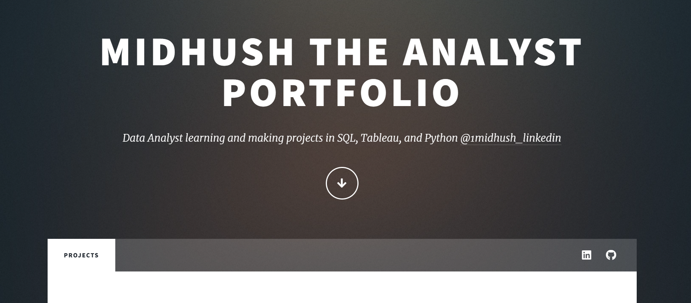

# Midhush The Analyst Portfolio

Welcome to my portfolio page! This repository contains the code for my personal portfolio website, where I showcase my data analytics projects and skills. Below you will find details about the content and structure of this project.

## Table of Contents

- [Introduction](#introduction)
- [Features](#features)
- [Technologies Used](#technologies-used)
- [Installation](#installation)
- [Usage](#usage)
- [Contact](#contact)
- [Acknowledgements](#acknowledgements)

## Introduction

This portfolio website serves as a central hub for all my data analytics projects. I am a Data Analyst skilled in SQL, Tableau, and Python. On this website, you will find detailed descriptions and links to my projects hosted on GitHub and Tableau Public.

## Features

- **Responsive Design:** The website is mobile-friendly and adjusts to different screen sizes.
- **Project Highlights:** Each project includes a description, an image, and a link to the project repository or visualization.
- **Social Media Integration:** Links to my LinkedIn and GitHub profiles for further engagement.
- **Contact Information:** Easy access to my email and location details.

## Technologies Used

- HTML5
- CSS3
- JavaScript
- [HTML5 UP Massively Template](https://html5up.net/massively)

## Installation

To set up this project locally, follow these steps:

1. Clone the repository:
    ```bash
    git clone https://github.com/1midhush/portfolio.git
    ```
2. Navigate to the project directory:
    ```bash
    cd portfolio
    ```
3. Open `index.html` in your preferred web browser.

## Usage

Feel free to explore the projects listed on the website. Click on the project titles or images to view the detailed descriptions and access the project repositories or visualizations.

## Contact

**Location:** Guwahati, India

**Email:** [sirigudimidhush2@gmail.com](mailto:sirigudimidhush2@gmail.com)

**Social:**
- [LinkedIn](https://www.linkedin.com/in/sirigudi-midhush)
- [GitHub](https://github.com/1midhush)

## Acknowledgements

- Design by [HTML5 UP](https://html5up.net)

Thank you for visiting my portfolio! If you have any questions or feedback, feel free to reach out to me via email or LinkedIn.


